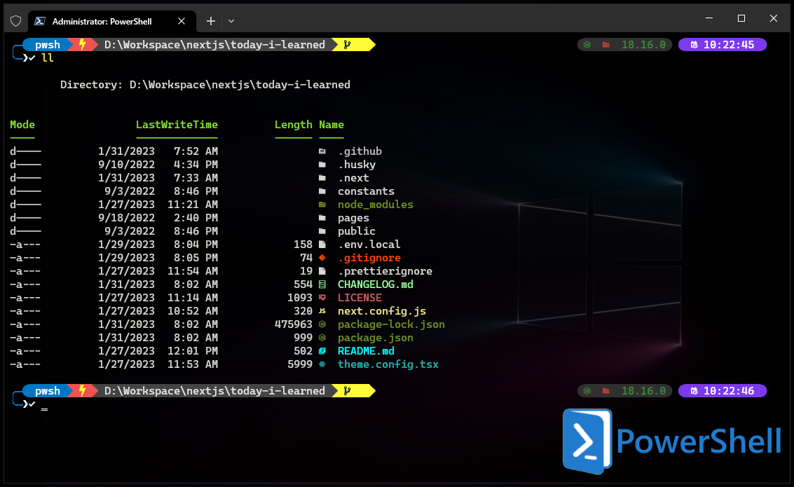

# Chanh's dotfiles

## PowerShell setup (Windows)

- [Scoop](https://scoop.sh/) - A command-line installer
- [Git for Windows](https://gitforwindows.org/)
- [Oh My Posh](https://ohmyposh.dev/) - Prompt theme engine
- [Nerd fonts](https://github.com/ryanoasis/nerd-fonts) - Powerline-patched fonts
- [Terminal Icons](https://github.com/devblackops/Terminal-Icons) - Folder and file icons
- [PSReadLine](https://docs.microsoft.com/en-us/powershell/module/psreadline/) - Cmdlets for customizing the editing environment, used for autocompletion
- [z](https://www.powershellgallery.com/packages/z) - Directory jumper
- [PSFzf](https://github.com/kelleyma49/PSFzf) - Fuzzy finder

## How to use

- [How to set up PowerShell prompt with Oh My Posh](https://phannhatchanh.com/blog/how-to-set-up-powershell-prompt-with-oh-my-posh)
